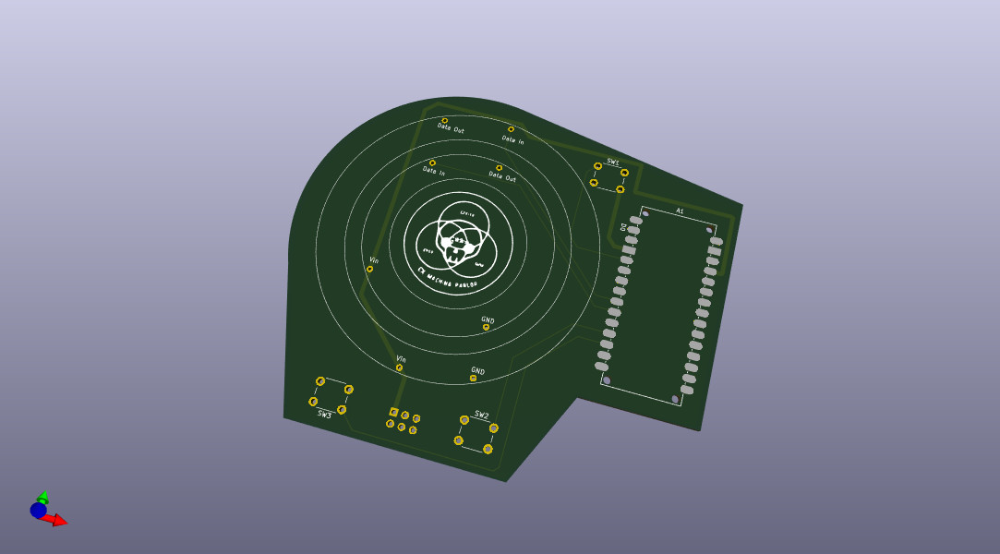

# LED_Ring_Cyclone

# Description
Arcade game similar to the classic Cyclone. Made to run on Arduino and to interface with [Neopixel rings](https://www.adafruit.com/product/1463#technical-details).

# Requirments
- Arduino (pro mini variant used)
- 2x Neopixel rings (or strips)
- 1x Push button
- 5V power Source (USB power will do for small LED strips like shown)

# How It Works
## Attract Mode
A simple rotating LED on Ring 1 and a slow blink on Ring 2.
Waits for a button press to transition to START_GAME.

## Start Game
Resets the chasing light and randomly selects (a jackpotIndex) one of the LEDs to act as the target.
Displays the jackpot briefly with a blue color. Immediately transitions to PLAY_GAME.

## Play Game
The chasing light (a single lit LED) moves around Ring 1 at intervals (set by chaseInterval).
When the button is pressed, the game captures the position and transitions to RESULT.

## Result
If chaseIndex matches jackpotIndex, it’s a win animation (flashing green).
Otherwise, a lose animation highlights the difference.
After the animation, returns to ATTRACT_MODE.

# Coming Soon
## SAO Board Version

# Requirments
- Arduino Nano Every
- 1x 16 LED Neopixel ring
- 1x 24 LED Neopixel ring
- 3x 6mm Push button
