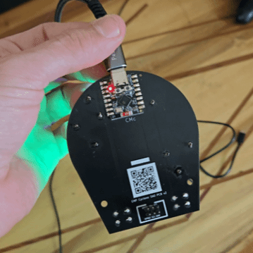

# EMP SAO Cyclone Badge

# Description
SAO with a simple arcade game similar to the classic Cyclone. Made to run on an ESP32-C3 and to interface with [Neopixel rings](https://www.adafruit.com/product/1463#technical-details).

# How to Play
## Attract Mode
A rotating purple LED on the outer ring and a slow blink of green on the inner ring is the default state
The SAO waits for a button press to transition to START_GAME

## Start Game
Resets the chasing light and randomly selects one of the LEDs to act as the target
Displays the jackpot briefly with a blue color. Immediately transitions to PLAY_GAME

## Play Game
A single lit LED moves around the outer ring.
The goal is to press the button when the active LED is over the previously displayed target LED

## Result
If the button is pressed when the active LED is on the target, it’s a win animation of flashing green
Otherwise, a lose animation of flashing red
After the animation the SAO returns to ATTRACT_MODE

# SAO BOM
- [ESP32-C3 Nano](https://www.amazon.com/ESP32-C3-Development-Bluetooth-Running-Frequency/dp/B0DFWG87JS/?th=1)
- 1x [24 LED Neopixel ring](https://www.amazon.com/dp/B0B2D7742J)
- 1x [16 LED Neopixel ring](https://www.amazon.com/dp/B0B2D5QXG5)
- 2x [Push button](https://www.amazon.com/YOUFEN-Button-Switch-Momentary-Tactile/dp/B0DPJVH8PC)
- 1x [2x3 0.1" Header pin box connector](https://www.amazon.com/gp/product/B00UBWKQLA/)
- 1x [SAO PCB]('./PCB/EMP_Cyclone_SAO_v1/Gerber.zip')
- 8x 0.1" Header pins (Included in ESP32-C3 purchase)

# Flashing the Badge
- Use the arduino IDE
- Set board type to "nologo ESP32C3 Supermini"
